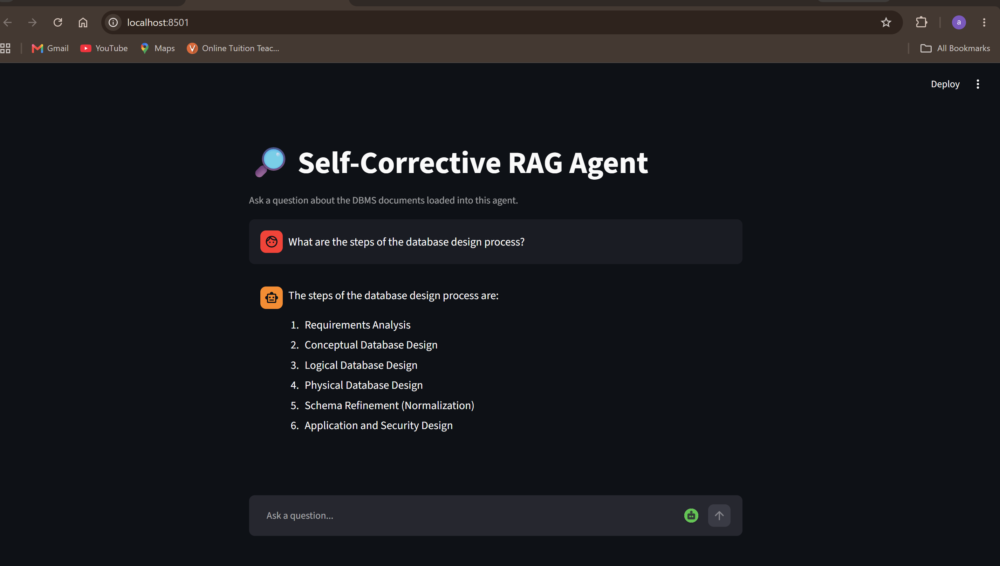
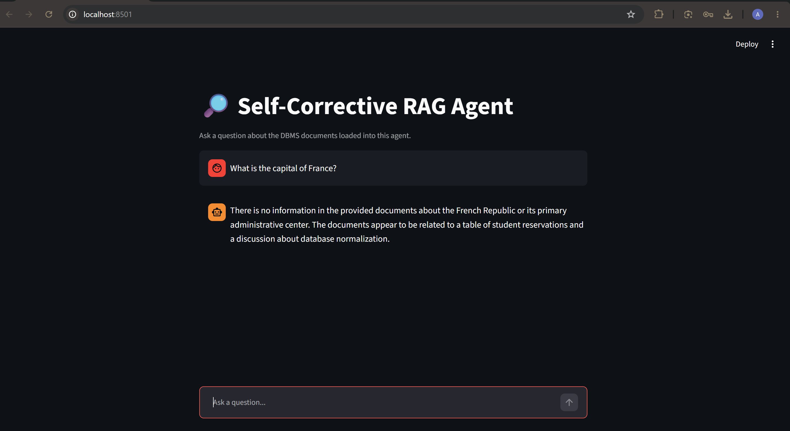
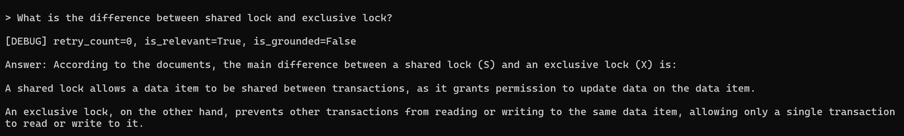
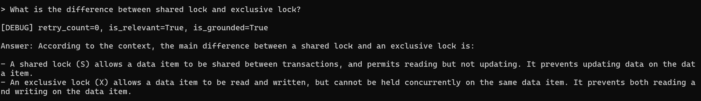

# Self-Corrective RAG Agent

This is a Q&A agent I built over my DBMS course notes, using LangGraph and LangChain. It's not just a basic "retrieve documents, ask the LLM" setup — it actually checks its own work. Before answering, it grades whether the documents it found are even relevant to the question, and if they're not, it rewrites the question and tries again. After generating an answer, it double-checks that answer against the source documents to make sure it isn't making anything up.

## Why bother with all this checking?

I built a plain RAG chain first (still in `chains.py`), and pretty quickly noticed the problem with it: it would just confidently answer things whether or not it actually had a good basis for the answer. It couldn't tell the difference between "this is in my documents" and "this sounds like something that's probably true." So I added two layers of self-checking on top — one before generating an answer (is this even relevant?) and one after (is this answer actually grounded in what I retrieved?).

Spoiler: even with both checks, it still slipped up once during testing, and figuring out exactly why turned out to be the most interesting part of this project. More on that below.

## How it works

Here's the flow, step by step:

A question comes in, and first a quick router decides if it's an actual question or just small talk — no point running the whole pipeline for "hi." If it's a real question, it goes to the retriever, which pulls the 4 most relevant chunks from my Chroma vector store.

Then comes the part that makes this different from a basic RAG setup: before generating anything, a grader node looks at the question and the retrieved chunks and asks "are these actually relevant, or did the search just find something that sounds similar?" If they're not relevant, the question gets rewritten — reworded to better match how my documents actually phrase things — and it goes back and searches again. This can happen up to two times before the agent gives up trying to find better documents and just moves on with whatever it has.

Once there's relevant context (or the retries run out), it generates an answer. But that's still not the final step — a hallucination checker then looks at the generated answer and asks whether it's actually backed up by the documents, or whether the model added something that isn't really there. If it's not grounded, the answer gets regenerated with a stricter prompt. And here's the part I added after finding a bug: that regenerated answer gets checked again too, instead of just being trusted. If it's still not grounded even after that, the user sees the answer along with an honest note that it couldn't be fully verified, rather than the app pretending everything's fine.

Two things I did on purpose, worth calling out:

**The retry loop can't run forever.** There's a counter (`retry_count`) that caps retries at 2. Without it, a question that just doesn't match anything in my documents would send the agent rewriting and re-searching indefinitely.

**The verification happens twice, not once.** Originally I only checked the answer once and blindly trusted whatever came out of the regeneration. Testing showed that wasn't safe — more on that below.

## Stack

- **LangGraph** for the actual agent logic — the state machine, the conditional branching, the retry loop
- **LangChain** for chaining prompts together
- **ChromaDB** as the vector store, running locally
- **Ollama**, running `llama3.2` and `nomic-embed-text` — I went with this instead of OpenAI so the whole thing is free and doesn't need an API key

## Running it

```bash
# install Ollama from ollama.ai first, then:
ollama pull llama3.2
ollama pull nomic-embed-text

python -m venv .venv
source .venv/bin/activate      # Windows: .venv\Scripts\activate
pip install -r requirements.txt

python ingest.py    # builds the vector store from whatever's in data/
python graph.py     # chat with it in the terminal
# or
streamlit run app.py  # or in a browser
```

## What I actually tested, and what I found

I put together a mix of questions — some I knew the documents could answer, some I knew they couldn't, and a few that sounded plausible but weren't actually covered. Here's what happened:

| Question | Relevant? | Grounded? | What happened |
|---|---|---|---|
| "Name different types of DBMS database models" | — | — | Correct, specific answer ✅ |
| "What are the steps of the database design process?" | — | — | Correct, specific answer ✅ |
| "What is the capital of France?" | False | False | Correctly said it didn't know ✅ |
| "What is database sharding?" | False | False | Correctly said it's not covered, even after checking my whole 5-unit syllabus ✅ |
| "What is a weak entity and how is it represented?" | True | True | Correct answer ✅ |
| "Explain ACID properties with a healthcare example" | True | **True — but wrong** | This is the interesting one, explained below |
| "Shared lock vs exclusive lock" (before I fixed the checker) | True | False (correctly caught!) | The answer actually had a fact backwards — it said shared locks let you write, when my notes say the opposite |
| "Shared lock vs exclusive lock" (after the fix) | True | True | Fixed and correct |
| "Natural join vs cartesian product" (after the fix) | True | True | Also fixed — the first attempt had blended the definition with a different concept |

### The one that got past my checker

My documents explain ACID properties using a bank withdrawal example. When I asked for a *healthcare* example instead, the agent got the actual ACID definitions right — but invented an entire scenario about a doctor updating patient records in a hospital EHR system, complete with specific details, none of which exist anywhere in my source material. My hallucination checker said "grounded: true" anyway.

Digging into why: the checker was verifying that the *facts* were correct (they were — Atomicity, Consistency, Isolation, Durability are all defined accurately) but wasn't catching that the *supporting example* was completely made up. It's checking accuracy, not checking whether the whole story was actually sourced from my documents.

I found this by adding debug logging to print `retry_count`, `is_relevant`, and `is_grounded` after every answer, which is honestly the single most useful thing I did all night for actually understanding what my own graph was doing.

### Finding a second, more concrete bug — and fixing it

Later, testing on lock types, I found something more clear-cut: the agent said shared locks "grant permission to update data," but my notes explicitly say the opposite — shared locks are read-only. This time the checker actually worked and flagged it as ungrounded. But the automatic regeneration that followed didn't fix it — it still came back wrong.

That told me my single regeneration attempt wasn't being verified at all, it was just trusted. So I changed `check_hallucination` to check the regenerated answer too, and if it's *still* not grounded, show it to the user with a visible caveat instead of quietly passing off a possibly-wrong answer as correct. Re-ran both broken examples after the fix, and both came back accurate.

## What I'd still call a limitation

- The hallucination checker looks at the answer as a whole rather than claim-by-claim, which is exactly how the ACID example slipped through even with two passes. Splitting the answer into individual claims and verifying each separately would probably catch this — I didn't have time to build that tonight, but it's the obvious next step.
- I'm running a small local model (llama3.2) instead of a bigger cloud one, and it's noticeably less consistent about returning clean JSON when I ask the grader/checker for structured output. I handle this defensively (stripping markdown fences, falling back safely on parse errors), but it's a real trade-off of going the free/local route.
- All this double-checking isn't free — a single question can trigger 5-8 LLM calls between routing, grading, retries, generation, and verification. Fine for a demo, would need real optimization for production.

## Example runs





**Shared lock vs exclusive lock — before and after the verification fix:**




